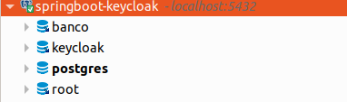
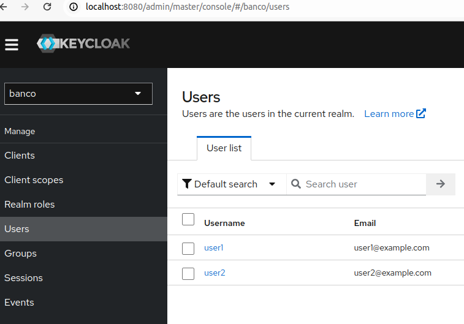
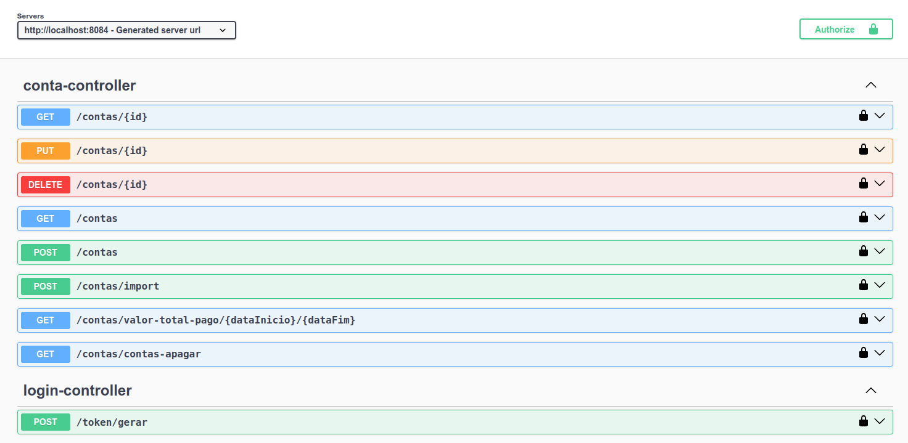

# springboot-keycloak

## Introdução

Bem-vindo ao projeto springboot-keycloak.

## Sobre o projeto:

##### Backend:

- Java 17
- Spring boot 3
- swagger
- arquitetura DDD

##### Banco de dados

- Postgres:13

##### Controle de Autenticação

- keycloak:23

##### Docker

- Sobe todos serviços backend, postgres e keycloak
- Subir a image postgres ele cria bases keycloak,banco
- Subir a image keycloak ele faz import e cria o realm do banco de dados e criando client e users

## Instalação

Para instalar o [Nome do Projeto], siga os passos abaixo:

### Requisitos

##### Dar permissao de execução para o arquivo import-realm.sh para rodar e fazer import do keycloak

> chmod +x import-realm.sh

### Passos de Instalação

1. Para rodar o projeto:
   ```sh
   docker compose up
   ```

## Sobre

#### Banco de dados

Dados conexão

- host: localhost
- port: 5432
- user: root
- password: root



#### keycloak

Acessar painel [keycloak](http://localhost:8080)

Usuário ADMIN

- login: admin
- password: admin

Sobre o import:

- Criado realm chamado banco
- Criado client chamdo banco

  - client_id: banco
  - Client Secret: banco_secret

- Criado dois usários user1 e user2
  - user1
    - login: user
    - senha: 123456
    - role: user
  - user2
    - login: admin
    - senha: 123456
    - role: user

##### Se ocorrer de não importar realm, vc pode importar na hora criar novo: arquivo _realm-export.json_ está na raiz do projeto



#### Backend

Acessar painel [swagger](http://localhost:8084/swagger-ui/index.html)



Para gerar acesso via keycloak [Gerar Token](http://localhost:8084/swagger-ui/index.html#/login-controller/getToken)

Todos serviços tem acesso com role user menos o serviço import csv [acessar](http://localhost:8084/swagger-ui/index.html#/conta-controller/importContas) que apenas quem tem role admin.

Sobre o serviço de import csv, tem o modelo de um arquivo csv na raiz do projeto com nome **import_conta.sh**
